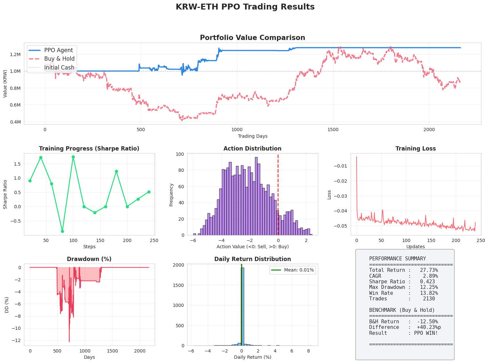
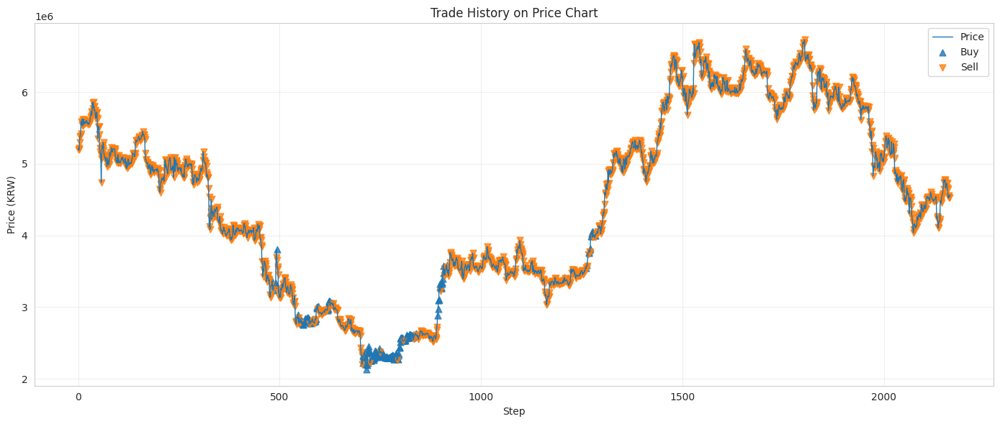

# RL_project_20241601
PPO 기반 암호화폐 트레이딩 에이전트

Upbit ETH/KRW 일봉(또는 분봉) 데이터를 사용하여  
PPO(Proximal Policy Optimization) 기반 트레이딩 에이전트를 학습하고,  
동일 기간의 Buy & Hold 전략과 성능을 비교한 프로젝트입니다.

---

## 1. 프로젝트 개요

- **문제 설정**  
  - 단일 자산(ETH/KRW)에 대해 강화학습 기반 트레이딩 전략을 학습한다.
  - 학습된 에이전트가 단순 Buy & Hold 전략과 비교했을 때 어느 정도 성능을 보이는지 평가한다.

- **목표**
  - 시계열 금융 데이터에 맞는 강화학습 환경을 직접 설계한다.
  - PPO 알고리즘을 구현하고, 여러 랜덤 시드에 대해 성능을 비교한다.
  - 총 수익률, Sharpe ratio, 최대 손실(MDD) 등의 지표로 전략을 평가한다.

---

## 2. 데이터 및 전처리

- **데이터 소스**: Upbit Public API  
- **자산**: ETH/KRW  
- **캔들 종류**: `minute240` (4시간봉)  <!-- TODO: 실제 사용한 interval에 맞게 수정 -->
- **기간**: TODO: 예) 2018-01-01 ~ 2024-01-01

전처리 과정:

1. Upbit API를 통해 OHLCV 데이터 수집
2. 기술적 지표 계산
   - 단순이동평균(SMA): 15, 60, 180
   - 지수이동평균(EMA): 36, 78
   - RSI, MACD, ATR 등
3. 피처 스케일링
   - `StandardScaler`를 이용하여 학습 구간 기준으로 정규화
4. Train / Eval 분할
   - 예: 앞 80%를 학습, 뒤 20%를 평가에 사용

---

## 3. 강화학습 환경 설계

### 3.1 상태 (State)

- 하나의 시점에서의 상태 벡터는 대략 **15차원**으로 구성됨.
- 포함되는 정보 예:
  - 정규화된 가격/수익률 피처 (SMA, EMA, RSI, MACD, ATR 등)
  - 보유 현금 비율
  - 보유 자산(ETH) 비율
  - 포지션 관련 간단한 상태 값

### 3.2 행동 (Action)

- 연속 행동 공간: \[-1, 1\]
  - -1에 가까울수록 강한 매도
  - +1에 가까울수록 강한 매수
- 실제 주문 비율은 `max_trade_frac`(예: 0.3)으로 제한
  - 예: action = 0.5 → 보유 현금의 0.5 × 0.3 = 15%만 매수

### 3.3 보상 (Reward)

- 한 스텝에서의 보상은 포트폴리오 수익률 기반으로 정의:

$r_t = \frac{Equity_{t+1} - Equity_t}{Equity_t}$

- 에피소드 전체 평가 시에는
  - 총 수익률 (Total Return %)
  - Sharpe ratio
  - Max Drawdown
  - 거래 횟수, 승률 등 추가 지표를 함께 사용

---

## 4. 사용 알고리즘: PPO

- **정책 네트워크 (Policy)**
  - 입력: 상태 벡터 (obs_dim)
  - 출력: 행동의 평균 μ(s) (연속 행동)
  - 구조: MLP, 예) 1024-1024 hidden layer, ReLU 활성함수

- **가치 네트워크 (Value)**
  - 입력: 상태 벡터
  - 출력: 상태 가치 V(s)
  - 구조: Policy와 유사한 MLP

- **주요 하이퍼파라미터**

| 항목            | 값 (예시)        |
|-----------------|------------------|
| seed            | 43               |
| total_steps     | 800,000          |
| rollout_len     | 512              |
| batch_size      | 2048             |
| epochs          | 10               |
| gamma           | 0.995            |
| gae_lambda      | 0.95             |
| clip_eps        | 0.05             |
| value_coef      | 0.50             |
| entropy_coef    | 0.03             |
| learning rate   | 3e-4             |
| max_grad_norm   | 1.0              |
| hidden sizes    | (1024, 1024)     |
| early stopping  | patience=10 등   |

(실제 사용한 값에 맞게 수정해서 채워 넣으면 됩니다.)

### 실행 시간 및 재현 권장 사항

이 노트북은 Google Colab 기준 **T4 GPU** 런타임에서

- **데이터 수집 + 전처리 + 단일 시드 모델 학습**까지 대략 **20분 내외**에 종료됩니다.
- 따라서, 이미 저장되어 있는 `.pt` 파일만 사용하는 것보다는  
  **처음부터 직접 학습을 돌려보면서 실험 과정을 확인하는 것**을 추천합니다.

> Colab에서 런타임 유형을 `GPU` → `T4`로 설정한 뒤  
> `ppo_trading.ipynb`를 상단 셀부터 순서대로 실행하면  
> 데이터 수집부터 백테스트 결과까지 한 번에 재현할 수 있습니다.

## 출력 예

